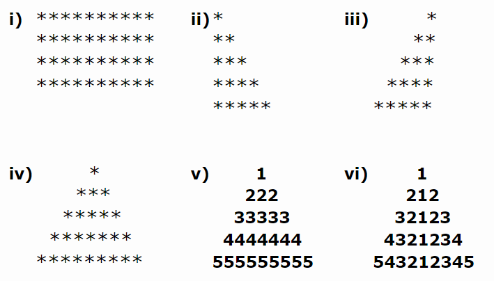

# Exercises 1 - Basic

1. Write a program to print numbers from 1 to 10.

```java
public class PrintNumbers
{
    public static void main(String[] args)
    {
        for(int i=1; i<=10; i++)
        {
            System.out.println(i);
        }
    }
}
```
<br>

2. Write a program to calculate the sum of first 10 natural number.

```java
public class SumNumbers
{
    public static void main(String[] args)
    {
        int sum = 0;
        for(int i=1; i<=10; i++)
        {
            sum += i;
        }
        System.out.println("Sum: " + sum);
    }
}
```
<br>

3. Write a program that prompts the user to input a positive integer. It should then print the multiplication table of that number. 

```java
import java.util.Scanner;

public class Table
{
    public static void main(String[] args)
    {
        Scanner console = new Scanner(System.in);
        int num;
        
        System.out.print("Enter any positive integer: ");
        num = console.nextInt();
                
        System.out.println("Multiplication Table of " + num);
        
        for(int i=1; i<=10; i++)
        {
            System.out.println(num +" x " + i + " = " + (num*i) );
        }
    }
}
```
<br>

4. Two numbers are entered through the keyboard. Write a program to find the value of one number raised to the power of another. (Do not use Java built-in method).

```java
import java.util.Scanner;

public class PowerDemo
{
    public static void main(String[] args)
    {
        Scanner console = new Scanner(System.in);

        int base;
        int power;
        int result = 1;

        System.out.print("Enter the base number ");
        base = console.nextInt();

        System.out.print("Enter the power ");
        power = console.nextInt();

        for(int i = 1; i <= power; i++)
        {
            result *= base;
        }

        System.out.println("Result: "+ result);
    }
}
```
<br>

5. Write a program to print following :




https://www.javatpoint.com/how-to-print-pattern-in-java
